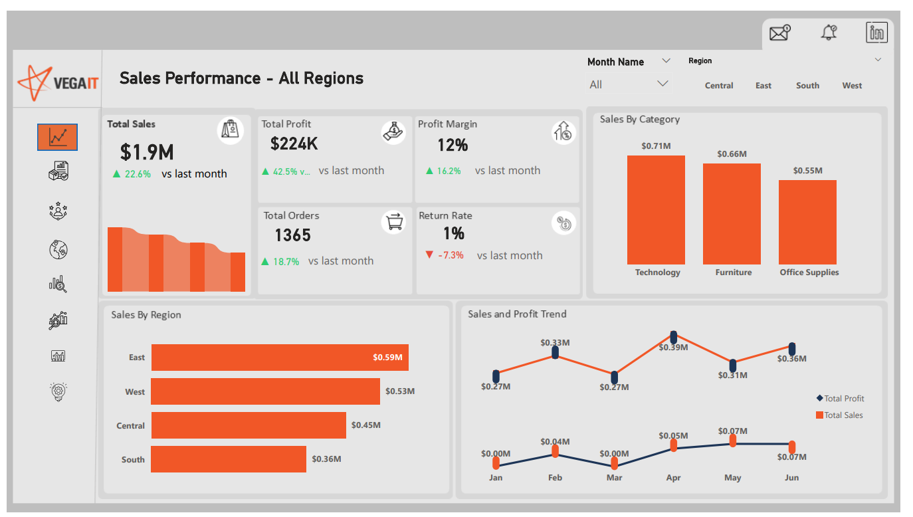
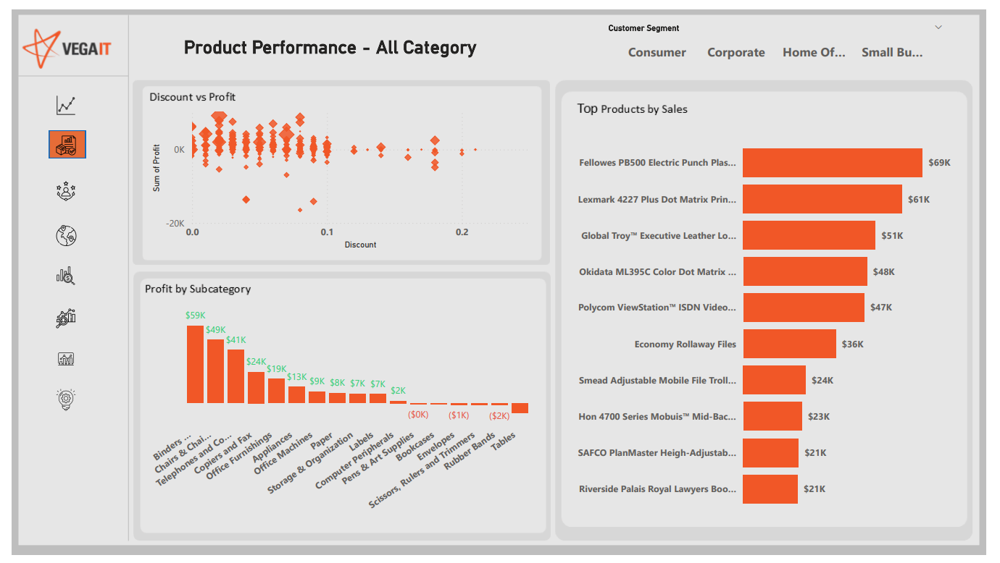
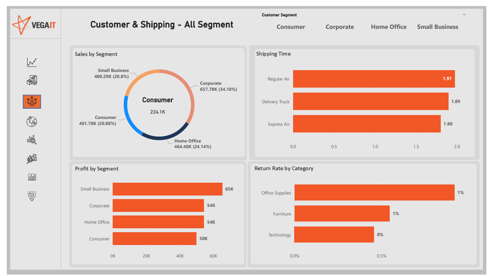
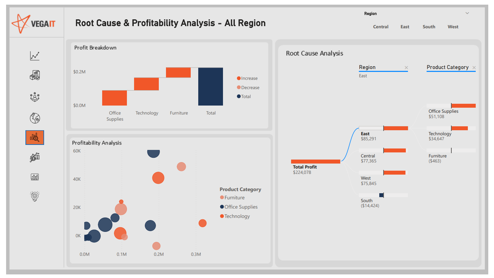

# Super Store Sales Analysis
**Vega IT Interview Assignment**

---

## Project Overview

This project analyses the **Super Store US dataset** to uncover actionable business insights about sales performance, profitability, customer behaviour, shipping efficiency, and regional accountability. The analysis is performed using Python for all data wrangling and transformations, and Power BI for interactive dashboard reporting.

### Key Findings at a Glance
- **Total Sales:** $1.9M across 6 months (Jan–Jun 2015)
- **Total Profit:** $224K at a 12% overall margin
- **South region is the only loss-making region:** -$14,424 profit driven by Technology discounting
- **Tables are loss-making across ALL customer segments** — a structural pricing problem
- **Small Business has the highest margin (16.2%)** despite being the smallest revenue segment
- **Profit collapses above 10% discount** — confirmed across all regions and categories

---

## Dashboard Screenshots

### Page 1 — Sales Performance (All Regions)


### Page 2 — Profit Performance (All Categories)


### Page 3 — Customer & Shipping


### Page 4 — Root Cause & Profitability Analysis


---

## Repository Structure

```
SakiruAkinpelu-SuperStore/
│
├── Super_Store_Sales_Analysis.ipynb   # Main Python analysis notebook
├── super_store_us.xlsx                # Source dataset (3 sheets: Orders, Returns, Users)
├── VegaIT_clean_superstore_data.csv   # Cleaned & enriched dataset (output of notebook)
├── VegaIT_Superstore_Data.pbix        # Power BI interactive report
├── screenshots/                       # Power BI dashboard screenshots
│   ├── 01_executive_overview.png
│   ├── 02_profit_performance.png
│   ├── 03_customer_shipping.png
│   └── 04_root_cause_analysis.png
└── README.md                          # This file
```

---

## Dataset Description

The source file `super_store_us.xlsx` contains 3 sheets:

| Sheet   | Rows  | Columns | Description                                                                 |
|---------|-------|---------|-----------------------------------------------------------------------------|
| Orders  | 1,952 | 25      | Order-level sales data including product, region, customer, discount, profit |
| Returns | 1,634 | 2       | Order IDs with "Returned" status                                            |
| Users   | 4     | 2       | Region-to-Manager mapping                                                   |

### Key Columns (Orders Sheet)
- `Order ID`, `Order Date`, `Ship Date`, `Ship Mode`
- `Customer ID`, `Customer Name`, `Customer Segment`
- `Product Category`, `Product Sub-Category`, `Product Name`
- `Sales`, `Profit`, `Discount`, `Quantity ordered new`, `Shipping Cost`
- `Region`, `State or Province`, `City`

### Derived Columns (Added in Notebook)
- `Shipping Days` — days between order and shipment
- `Profit Margin` — profit as a percentage of sales
- `Month` — period column for monthly grouping
- `Returned` — Yes/No flag joined from Returns sheet
- `Manager` — regional manager joined from Users sheet

---

## Setup & Installation

### Prerequisites
- Python 3.8 or higher
- Jupyter Notebook or JupyterLab
- Power BI Desktop (for the `.pbix` file)

### Step 1 — Clone the Repository
```bash
git clone https://github.com/SakiruAkinpelu/SakiruAkinpelu-SuperStore.git
cd SakiruAkinpelu-SuperStore
```

### Step 2 — Install Python Dependencies
```bash
pip install pandas openpyxl matplotlib seaborn numpy
```

Or using a requirements file:
```bash
pip install -r requirements.txt
```

**requirements.txt contents:**
```
pandas>=1.5.0
openpyxl>=3.0.0
matplotlib>=3.5.0
seaborn>=0.12.0
numpy>=1.23.0
```

### Step 3 — Run the Notebook
```bash
jupyter notebook Super_Store_Sales_Analysis.ipynb
```

Or with JupyterLab:
```bash
jupyter lab Super_Store_Sales_Analysis.ipynb
```

> **Important:** Make sure `super_store_us.xlsx` is in the **same directory** as the notebook before running. The notebook reads the file using a relative path.

### Step 4 — Run All Cells
In Jupyter, go to **Kernel → Restart & Run All** to execute the full analysis from scratch.

The notebook will automatically generate the cleaned CSV file `VegaIT_clean_superstore_data.csv` in the same directory.

---

## Power BI Dashboard

Open `VegaIT_Superstore_Data.pbix` in **Power BI Desktop** (free download from [powerbi.microsoft.com](https://powerbi.microsoft.com)).

The report contains 4 interactive pages:

| Page | Title                              | Description                                                                 |
|------|------------------------------------|-----------------------------------------------------------------------------|
| 1    | Sales Performance — All Regions    | KPI cards, sales/profit trend, sales by category and region                 |
| 2    | Profit Performance — All Category  | Discount vs profit scatter, profit by sub-category, top products            |
| 3    | Customer & Shipping                | Sales/profit by segment, shipping time, return rates                        |
| 4    | Root Cause & Profitability Analysis| Waterfall profit breakdown, scatter profitability, regional drill-down      |

### Slicers Available
- **Month Name** — filter by individual months (Jan–Jun)
- **Region** — filter by Central, East, South, West
- **Customer Segment** — filter by Consumer, Corporate, Home Office, Small Business
- **Product Sub-Category** — filter by any product sub-category

---

## Analysis Summary

### Python Notebook (9 Sections)

1. **Setup & Data Loading** — imports, chart styling, reading all 3 Excel sheets
2. **Data Cleaning & Transformation** — date conversion, derived columns, joins, null checks
3. **Exploratory Data Analysis** — overview statistics, correlation heatmap
4. **Sales Performance** — monthly trend, by category, by region
5. **Profitability Analysis** — top/loss products, sub-category profit, discount analysis, segment × subcategory heatmap
6. **Customer & Segment Analysis** — sales share, profit margin, segment comparison
7. **Shipping & Returns Analysis** — shipping time by mode, return rates by category and segment
8. **Regional & Manager Accountability** — manager performance comparison, top/bottom states
9. **Key Business Insights & Recommendations** — summary table and action plan

---

## Key Business Recommendations

| Priority    | Action                                                                                        |
|-------------|-----------------------------------------------------------------------------------------------|
| 🔴 Critical | Audit all South region Technology deals — the only loss-making territory at -$14,424          |
| 🔴 Critical | Reprice or phase out the Tables product line — loses money across all 4 customer segments     |
| 🟠 High     | Cap company-wide discounts at 10% — profit collapses above this threshold                    |
| 🟠 High     | Investigate the West region ~$100K Technology deal generating -$20K loss                      |
| 🟡 Medium   | Protect Small Business margins — highest efficiency segment at 16.2% margin                   |
| 🟡 Medium   | Reduce Home Office Office Supplies returns — highest return rate combination at 2%            |

---

## Tools Used

| Tool                          | Purpose                                      |
|-------------------------------|----------------------------------------------|
| Python (pandas)               | Data loading, cleaning, joins, transformations |
| Python (matplotlib, seaborn)  | Data visualisation                           |
| Power BI Desktop              | Interactive dashboard reporting              |
| Git / GitHub                  | Version control and submission               |

---

## Author

**Sakiru Akinpelu**  
Vega IT Interview Assignment — Super Store Sales Analysis  
2026

[](https://github.com/SakiruAkinpelu)
